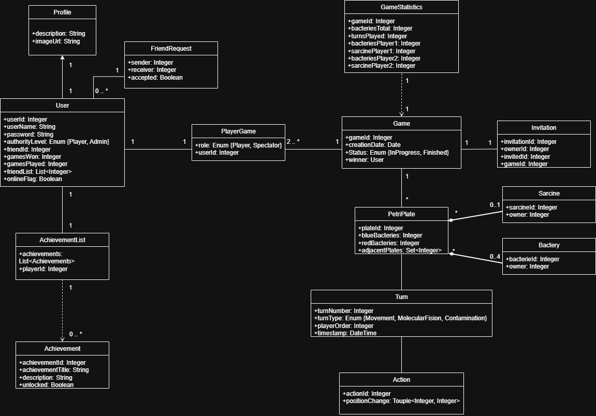

# Documento de análisis de requisitos del sistema

**Asignatura:** Diseño y Pruebas (Grado en Ingeniería del Software, Universidad de Sevilla)  
**Curso académico:** 2025/2026
**Grupo/Equipo:** Grupo 2 L4-01
**Nombre del proyecto:** Petris
**Repositorio:** https://github.com/gii-is-DP1/dp1-2025-2026-l4-1
**Integrantes (máx. 6):**
Jesús Cárdenas Conejo (jescarcon / jescarcon@alum.us.es)
Guillermo Ciria González (NQP9307 / guicirgon@alum.us.es, gciria@us.es)
Jaime González de Herrera Soriano (JMQ0481 / jaigonsor@us.es)
Conor López Chivite (LCY2956 / conlopchi@alum.us.es)
Lucas Ronquillo Bernáldez (HGK2646 / lucronber@alum.us.es)
Roberto Serrano Villalba (XDW2012 / robservil@alum.us.es)

## Introducción

_En esta sección debes describir de manera general cual es la funcionalidad del proyecto a rasgos generales. ¿Qué valor puede aportar? ¿Qué objetivos pretendemos alcanzar con su implementación? ¿Cuántos jugadores pueden intervenir en una partida como máximo y como mínimo? ¿Cómo se desarrolla normalmente una partida?¿Cuánto suelen durar?¿Cuando termina la partida?¿Cuantos puntos gana cada jugador o cual es el criterio para elegir al vencedor?_

[Enlace al vídeo de explicación de las reglas del juego / partida jugada por el grupo](https://www.youtube.com/watch?v=ZcoIduJaJIo)

## Tipos de Usuarios / Roles

**Jugador:** Un usuario registrado que no es administrador. Puede modificar su perfil, enviar y aceptar/rechazar solicitudes de amistad, gestionar su lista de amigos, crear y unirse a partidas públicas y privadas y eliminar su cuenta.

**Jugador en partida:** Un jugador que está en medio de una partida. Puede mover sus bacterias en sus fases de propagación, escribir en el chat, invitar espectadores y abandonar la partida.

**Espectador:** Un espectador ve la partida en tiempo real de otros dos jugadores. Puede escribir en el chat, aunque sus mensajes sólo pueden ser vistos por otros espectadores, pero no puede interactuar de ninguna forma con la partida.

**Administrador:** Un administrador tiene control casi total sobre el sistema. Puede modificar y eliminar jugadores; crear, modificar y eliminar logros; y eliminar partidas públicas y privadas.

## Historias de Usuario

A continuación se definen todas las historias de usuario a implementar:

### **Gestión de perfiles**

### H-01: Registrar jugador

| Como usuario, quiero registrarme como jugador en el sistema para poder identificarme y acceder a las funcionalidades de jugador. |
| ------------------------------------------------------------------------------------------------------------------------------------ |
| *Mockups (si hay)*                                      |
**H-01+E1: Éxito al registrar jugador**
Dado un usuario que introduzca un nombre, contraseña y campos de perfil con formato correcto al intentar registrar un jugador, se creará un jugador en la base de datos con dichas credenciales, y el usuario iniciará sesión como dicho jugador.
**H-01-E2: Intentar registrar jugador con datos no válidos**
Dado un usuario que introduzca un nombre, contraseña y/o campo/s de perfil con formato incorrecto al intentar registrar un jugador, se mostrará un error en pantalla indicando que los datos no son válidos y el jugador no será creado en la base de datos.

### H-02: Iniciar sesión

| Como usuario, quiero iniciar sesión como un jugador/administrador existente en la base de datos del sistema para poder identificarme y acceder a las funcionalidades de jugador. |
| ------------------------------------------------------------------------------------------------------------------------------------ |
| *Mockups (si hay)*                                      |
**H-02+E1: Éxito al iniciar sesión**
Dado un usuario que introduzca un nombre y/o contraseña asociados a un jugador/administrador existente en la base de datos del sistema al intentar iniciar sesión, el usuario iniciará sesión como dicho jugador.
**H-02-E2: Intentar iniciar sesión con nombre de usuario inexistente**
Dado un usuario que introduzca un nombre no asociado a ningún jugador/administrador de la base de datos del sistema al intentar iniciar sesión, se mostrará un error en pantalla indicando que ningún jugador de la base de datos tiene dicho nombre y el usuario no iniciará sesión.
**H-02-E3: Intentar iniciar sesión con contraseña incorrecta**
Dado un usuario que introduzca un nombre y contraseña donde la contraseña no esté asociada al jugador/administrador con dicho nombre en la base de datos al intentar iniciar sesión, se mostrará un error en pantalla indicando el jugador/administrador con dicho nombre no tiene dicha contraseña y el usuario no iniciará sesión.

### H-03: Cerrar sesión

| Como jugador, quiero cerrar mi sesión para poder dejar de usar el sistema y permitir a otro usuario iniciar sesión. |
| ------------------------------------------------------------------------------------------------------------------------------------ |
| *Mockups (si hay)*                                      |
**H-03+E1: Éxito al cerrar sesión**
Dado un jugador con una sesión iniciada que intente cerrarla, la sesión se cerrará de forma segura y la aplicación volverá a la pantalla de inicio.
**H-03-E2: Jugador inexistente**
Dado un jugador que no esté en la base de datos con una sesión iniciada que intente cerrarla, se mostrará un error indicando que el usuario no existe.

### H-04: Ver perfil

| Como jugador, quiero ver mi perfil para poder comprobar qué información muestro sobre mí. |
| ------------------------------------------------------------------------------------------------------------------------------------ |
| *Mockups (si hay)*                                      |
**H-04+E1: Éxito al ver perfil**
Dado un jugador que intente ver su perfil, se le mostrará junto con toda su información: últimos logros obtenidos, estadísticas y datos personales.
**H-04+E2: Éxito al ver todos los logros**
Dado un jugador que intente ver todos sus logros desde su perfil, se mostrará una lista de todos los logros del juego, mostrando para cada uno si se ha obtenido o no y cómo obtenerlo.
**H-04-E3: Jugador inexistente**
Dado un jugador que no esté en la base de datos que intente ver su perfil, se mostrará un error indicando que el usuario no existe.

### H-05: Editar perfil

| Como jugador, quiero editar mi perfil para poder elegir qué información muestro sobre mí. |
| ------------------------------------------------------------------------------------------------------------------------------------ |
| *Mockups (si hay)*                                      |
**H-05+E1: Éxito al editar perfil**
Dado un jugador que introduzca campos de perfil con formato correcto al intentar editar su perfil, los valores de su perfil serán reemplazados correctamente con los que ha introducido.
**H-05-E2: Editar perfil con datos no válidos**
Dado un jugador que introduzca campos de perfil con formato incorrecto al intentar editar su perfil, se mostrará un error en pantalla indicando que los datos no son válidos y los valores de su perfil no cambiarán.
**H-05-E3: Jugador inexistente**
Dado un jugador que no esté en la base de datos que intente editar su perfil, se mostrará un error indicando que el usuario no existe.

### H-06: Eliminar jugador

| Como jugador, quiero eliminar mi cuenta para poder deshacerme de los datos de mí que estén guardados en la base de datos del sistema. |
| ------------------------------------------------------------------------------------------------------------------------------------ |
| *Mockups (si hay)*                                      |
**H-06+E1: Éxito al eliminar jugador**
Dado un jugador que intente eliminar su cuenta, al introducir su contraseña dicho jugador será completamente eliminado de la base de datos del sistema, junto con todos sus datos asociados.
**H-06-E2 - Contraseña incorrecta**
Dado un jugador que intente eliminar su cuenta, al introducir una contraseña incorrecta, dicho jugador no se eliminará de la base de datos y se dará un mensaje de error.
**H-06+E3: Jugador inexistente**
Dado un jugador que no esté en la base de datos que intente eliminar su cuenta, se mostrará un error indicando que el usuario no existe.

### **Gestión de amigos**

### H-07: Enviar solicitud de amistad

| Como jugador, quiero enviar solicitudes de amistad a otros jugadores para poder ser amigos y jugar partidas juntos. |
| ------------------------------------------------------------------------------------------------------------------------------------ |
| *Mockups (si hay)*                                      |
**H-07+E1: Éxito al enviar solicitud de amistad**
Dado un jugador que intente enviar una petición de amistad mediante el código de amigo de otro jugador, la petición será enviada al jugador correctamente.
**H-07-E2: Jugador/es inexistente/s**
Dado un jugador que intente enviar una petición de amistad mediante el código de amigo de otro jugador, no estando el jugador que la envía y/o el que la recibe en la base de datos, se mostrará un error indicando que el/los usuario/s no existe/n.
**H-07-E3: Solicitud de amistad a sí mismo**
Dado un jugador que intente enviar una petición de amistad mediante su mismo código de amigo, se mostrará un error indicando que no se puede enviar una solicitud de amistad a uno mismo.
**H-07-E4: Solicitud de amistad a amigo**
Dado un jugador que intente enviar una petición de amistad mediante el código de amigo de un jugador que ya es su amigo, se mostrará un error indicando que no se puede enviar una solicitud de amistad a un jugador que ya sea tu amigo.
**H-07-E5: Solicitud de amistad a jugador con solicitud pendiente**
Dado un jugador que intente enviar una petición de amistad mediante el código de amigo de otro jugador, cuando ya existe una solicitud pendiente de un jugador al otro o viceversa, se mostrará un error indicando que aún hay una solicitud pendiente de gestionar.
**H-07-E6: Solicitud de amistad a administrador**
Dado un jugador que intente enviar una petición de amistad mediante el código de amigo de un administrador, se mostrará un error indicando que no se puede enviar una solicitud de amistad a un administrador.

### H-08: Gestionar solicitudes de amistad

| Como jugador, quiero gestionar las solicitudes de amistad que haya recibido de otros jugadores para poder aceptarlas o ignorarlas. |
| ------------------------------------------------------------------------------------------------------------------------------------ |
| *Mockups (si hay)*                                      |
**H-08+E1: Éxito al ver solicitudes de amistad**
Dado un jugador que intente ver sus solicitudes de amistad, se mostrará una lista con todas las solicitudes de amistad que ha recibido y aún no haya aceptado o ignorado.
**H-08+E2: Éxito al aceptar solicitud de amistad**
Dado un jugador que intente aceptar una solicitud de amistad que reciba de otro jugador, la solicitud será aceptada y los dos jugadores se convertirán en amigos.
**H-08+E3: Éxito al ignorar solicitud de amistad**
Dado un jugador que intente ignorar una petición de amistad que reciba de otro jugador, la petición será ignorarada, desapareciendo de la lista de peticiones, y los dos jugadores no serán amigos.
**H-08-E4: Jugador/es inexistente/s**
Dado un jugador que intente aceptar o ignorar una petición de amistad, no estando el jugador que la envía y/o el que la recibe en la base de datos, se mostrará un error indicando que el/los usuario/s no existe/n.
**H-08-E5: Solicitud inexistente**
Dado un jugador que intente aceptar o ignorar una petición de amistad que no esté en la base de datos, se mostrará un error indicando que la solicitud no existe.
**H-08-E6: Jugadores amigos**
Dado un jugador que intente aceptar o ignorar una petición de amistad de un jugador que es su amigo, se mostrará un error indicando que los dos ya son amigos.

### H-09: Gestionar amigos

| Como jugador, quiero gestionar los amigos que tengo en la aplicación para poder comprobar qué usuarios son mis amigos y ver cuáles están en línea. |
| ------------------------------------------------------------------------------------------------------------------------------------ |
| *Mockups (si hay)*                                      |
**H-09+E1: Lista de amigos**
Dado un jugador que intente ver sus amigos, se mostrará una lista con todos los que tenga, indicando si cada uno está en línea o no.
**H-09+E2: Lista vacía de amigos**
Dado un jugador que intente ver sus amigos sin tener ninguno, se mostrará una lista vacía con un mensaje que indique que el usuario aún no tiene amigos.
**H-09+E3: Éxito al eliminar amigo**
Dado un jugador que intente eliminar un jugador de su lista de amigos, ambos jugadores ya no serán amigos.
**H-09-E4: Jugador inexistente al eliminar amigo**
Dado un jugador que intente eliminar un jugador de su lista de amigos, no estando el jugador que la envía y/o el que la recibe en la base de datos, se mostrará un error indicando que el/los usuario/s no existe/n.
**H-09-E5: Jugador no amigo al eliminar amigo**
Dado un jugador que intente eliminar un jugador que no es su amigo de su lista de amigos, se mostrará un error indicando que el usuario no es su amigo.

### **Gestión de partidas**

### H-10: Ver partidas

| Como jugador, quiero ver las partidas que existan para poder decidir si me interesa unirme o espectar alguna. |
| ------------------------------------------------------------------------------------------------------------------------------------ |
| *Mockups (si hay)*                                      |
**H-10+E1: Éxito al ver partidas públicas**
Dado un jugador que intente ver las partidas públicas abiertas, se mostrará una lista con todas las partidas públicas con un solo jugador esperando que aún no hayan empezado.
**H-10+E2: Éxito al ver invitaciones de jugar o espectar partida privada**
Dado un jugador que intente ver las invitaciones de jugar o espectar partida privada que haya recibido, se mostrará una lista con todas las invitaciones que no haya aceptado o rechazado.

### H-11: Unirse a partida

| Como jugador, quiero unirme a alguna partida para poder jugar a Petris. |
| ------------------------------------------------------------------------------------------------------------------------------------ |
| *Mockups (si hay)*                                      |
**H-11+E1: Éxito al unirse a partida pública**
Dado un jugador que intente unirse a una partida pública con un solo jugador esperando que aún no haya empezado, se le llevará a esa partida, la cual comenzará.
**H-11+E2: Éxito al aceptar invitación de jugar partida privada**
Dado un jugador que intente aceptar una invitación de jugar partida privada de uno de sus amigos, se abrirá una pantalla para mostrar las normas de la partida. Si se acepta la invitación, la partida comenzará.
**H-11-E3: Partida inexistente**
Dado un jugador que intente unirse a una partida pública que no esté en la base de datos, se mostrará un error indicando que la partida no existe.
**H-11-E4: Invitación inexistente**
Dado un jugador que intente aceptar una invitación de jugar partida privada que no esté en la base de datos, se mostrará un error indicando que la invitación no existe.
**H-11-E5: Jugador/es inexistente/s**
Dado un jugador que intente unirse a una partida pública o privada, no estando el jugador que la envía y/o el que está esperando a que comience en la base de datos, se mostrará un error indicando que el/los usuario/s no existe/n.

### H-12: Crear partida

| Como jugador, quiero crear una partida pública para poder jugar a Petris con otro usuario. |
| ------------------------------------------------------------------------------------------------------------------------------------ |
| *Mockups (si hay)*                                      |
**H-12+E1: Éxito al crear partida pública**
Dado un jugador que intente crear una partida pública, se abrirá una pantalla para configurar las normas de la partida. Si la partida se crea, aparecerá en la lista de partidas públicas y comenzará cuando otro usuario se una a ella.
**H-12+E2: Éxito al enviar invitación de jugar partida privada**
Dado un jugador que intente enviar una invitación de jugar partida privada a uno de sus amigos, se abrirá una pantalla para configurar las normas de la partida. Si la partida se crea, dicho amigo recibirá la invitación y la partida comenzará cuando la acepte.
**H-12-E3: Jugador/es inexistente/s**
Dado un jugador que intente crear una partida pública o enviar una invitación de jugar partida privada a uno de sus amigos, no estando el jugador que la envía y/o el amigo en la base de datos, se mostrará un error indicando que el/los usuario/s no existe/n.
**H-12-E4: Jugador no amigo al enviar invitación**
Dado un jugador que intente enviar una invitación de jugar partida privada a un jugador que no es ssu amigo, se mostrará un error indicando que el usuario ya no es su amigo.

### H-13: Espectar partida

| Como jugador, quiero espectar una partida que estén jugando mis amigos para poder ver el curso de su partida. |
| ------------------------------------------------------------------------------------------------------------------------------------ |
| *Mockups (si hay)*                                      |
**H-13+E1: Éxito al enviar invitación de espectar partida privada**
Dado un jugador que intente enviar una invitación de espectar partida privada, se abrirá una pantalla para que el jugador decida a qué amigo se la mandará (solo aparecerán los usuarios que sean amigos con ambos participantes de la partida). Si se escoge a un amigo, recibirá la invitación.
**H-13+E2: Éxito al aceptar invitación de espectar partida privada**
Dado un jugador que intente aceptar una invitación de espectar partida privada de uno de sus amigos, se abrirá una pantalla para mostrar las normas de la partida y quiénes la están jugando. Si se acepta la invitación, se mostrará la partida que se está jugando en tiempo real.

### H-14: Rechazar invitaciones recibidas

| Como jugador, quiero rechazar las invitaciones que reciba de mis amigos para que no me aparezcan si no me interesan. |
| ------------------------------------------------------------------------------------------------------------------------------------ |
| *Mockups (si hay)*                                      |
**H-14+E1: Éxito al rechazar invitación de jugar partida privada**
Dado un jugador que intente aceptar una invitación de jugar partida privada de uno de sus amigos, se abrirá una pantalla para mostrar las normas de la partida. Si se rechaza la invitación, la invitación será deshechada y la partida no comenzará.
**H-14+E2: Éxito al rechazar invitación de espectar partida privada**
Dado un jugador que intente aceptar una invitación de espectar partida privada de uno de sus amigos, se abrirá una pantalla para mostrar las normas de la partida y quiénes la están jugando. Si se rechaza la invitación, la invitación será deshechada y la partida no se espectará.
**H-14-E3: Invitación inexistente**
Dado un jugador que intente rechazar una invitación que no esté en la base de datos (por haber expirado), se mostrará un error indicando que la invitación no existe.
**H-14-E4: Jugador/es inexistente/s**
Dado un jugador que intente rechazar una invitación, no estando el jugador que la envía y/o el que la recibe en la base de datos, se mostrará un error indicando que el/los usuario/s no existe/n.

### **Desarrollo de partida**

### H-15: Funcionamiento de la partida

| Como jugador en partida, quiero que la partida que estoy jugando funcione correctamente para poder jugar a Petris con otros jugadores sin complicaciones. |
| ------------------------------------------------------------------------------------------------------------------------------------ |
| *Mockups (si hay)*                                      |
**H-15+E1: Fases**
Una partida avanzará de una fase a la siguiente, de la forma definida por el tablero de ayuda (los círculos indican fases de propagación, los rectángulos verdes indican fases de fisión y el rectángulo amarillo indica fase de contaminación) hasta que la partida termine. Las fases de propagación tienen asociadas un jugador, que es el que deberá mover sus bacterias para llegar a la siguiente fase; aparte de ésta, las demás fases avanzan automáticamente.
**H-15-E2: Acción de jugador en fase incorrecta**
Dado un jugador en partida que intente mover sus bacterias en una fase que no sea de las suyas de propagación, la aplicación ignorará su acción.
**H-15-E3: Abandono de partida**
Dado un jugador en partida que abandone la partida, la partida terminará sin ganador.
**H-15-E4: Jugador/es inexistente/s**
Dado un jugador en partida o espectador, no estando el usuario y/o los jugadores de la partida en la base de datos, se mostrará un error indicando que el/los usuario/s no existe/n (si el usuario era uno de los jugadores de la partida, la partida terminará).
**H-15-E5: Jugadores no amigos en partida privada**
Dado un jugador en partida o espectador en una partida privada, no siendo amigo de el/los jugador/es, se mostrará un error indicando que es necesario ser amigo de todos los jugadores de la partida (si el usuario era uno de los jugadores de la partida, la partida terminará).
**H-15-E6: Espectador no amigo de jugadores en partida pública**
Dado un espectador en una partida pública, no siendo amigo de alguno de los jugadores, se mostrará un error indicando que es necesario ser amigo de todos los jugadores de la partida.
**H-15-E7: Partida inexistente**
Dado un jugador en partida o espectador, no estando la partida en la base de datos, se mostrará un error indicando que la partida no existe.

### H-16: Ver información de partida

| Como jugador en partida o espectador, quiero ver la información de la partida que esté jugando o espectando para poder saber cómo va. |
| ------------------------------------------------------------------------------------------------------------------------------------ |
| *Mockups (si hay)*                                      |
**H-16+E1: Éxito al ver información de partida**
Dado un jugador en partida o espectador, se mostrarán los siguientes aspectos en tiempo real: posición de las bacterias y sarcinas, tablero de ayuda que indica cuál es la fase actual y las siguientes, y puntos de contaminación de cada jugador.

### H-17: Condiciones de victoria

| Como jugador en partida, quiero que la partida que estoy jugando tenga condiciones de victoria para poder intentar ganar, sabiendo que la aplicación detectará mi victoria o derrota correctamente. |
| ------------------------------------------------------------------------------------------------------------------------------------ |
| *Mockups (si hay)*                                      |
**H-17+E1: Sin movimientos disponibles**
Dado un jugador en partida cuando sea una de sus fases de propagación, si no puede hacer ningún movimiento válido, la partida terminará con su derrota y la victoria del otro jugador.
**H-17+E2: Máximo de puntos de contaminación**
Dado un jugador en partida cuando sea una fase de contaminación, si al final de la fase ha alcanzado C puntos de contaminación (siendo C un número que el creador de la partida escogerá), la partida terminará con su derrota y la victoria del otro jugador.
**H-17+E3: Fase de contaminación final**
Dado un jugador en partida cuando sea la última fase de contaminación, si al final de la fase aún no se ha decidido el ganador, se observarán los puntos de contaminación de cada jugador. Si dicho jugador es el que tiene más puntos, la partida terminarácon su derrota y la victoria del otro jugador.
**H-17+E4: Desempate**
Si ambos jugadores de partida han llegado a una condición de derrota en la misma fase, el ganador se decidirá por quién tiene menos bacterias en el tablero (contando también las sarcinas, que valen S bacterias cada una, siendo S un número que el creador de la partida escogerá). Si no se llega a desempatar de ese modo, el ganador será el jugador con menos sarcinas en el tablero. Si se ha decidido el ganador, la partida terminará con su victoria y la derrota del otro jugador.
**H-17-E5: Imposible desempatar**
Si se ha intentado desempatar y no se ha decidido ningún ganador, la partida terminará en empate, y ninguno de los jugadores ganará o perderá.

### H-18: Fase de propagación

| Como jugador en partida, quiero que la partida que estoy jugando tenga fases de progapación para poder mover mis bacterias por el tablero. |
| ------------------------------------------------------------------------------------------------------------------------------------ |
| *Mockups (si hay)*                                      |
**H-18+E1: Mover bacterias**
Dado un jugador en partida cuando sea una fase suya de propagación, puede mover sus bacterias de una loseta a otra si el movimiento es válido (el movimiento es válido si no incumple los escenarios negativos de esta historia de usuario).
**H-18+E2: Fin de fase**
Dado un jugador en partida cuando sea una fase suya de propagación, la fase terminará si el jugador mueve todas las bacterias de una loseta de forma válida, o si no mueve todas las bacterias de una loseta pero sí termina la fase manualmente.
**H-18+E3: Reiniciar fase**
Dado un jugador en partida cuando sea una fase suya de propagación, si ha movido una o más bacterias pero aún no ha terminado la fase, puede reiniciarla para deshacer los movimientos que ha hecho.
**H-18+E4: Creación de sarcinas**
Dado un jugador en partida cuando sea una fase suya de propagación, al final de la fase se observarán las losetas y, para cada una, se reemplazarán cada S bacterias del jugador por una sarcina (siendo S un número que el creador de la partida escogerá).
**H-18-E5: Bacterias desde varias losetas**
Dado un jugador en partida cuando sea una fase suya de propagación, si ha movido una bacteria de una loseta a otra, y después intenta mover una bacteria de una loseta distinta, la aplicación deshará el movimiento e indicará que todas las bacterias que se muevan deben pertenecer a la misma loseta.
**H-18-E6: Loseta/s no adyacente/s**
Dado un jugador en partida cuando sea una fase suya de propagación, si intenta mover una bacteria a una loseta no adyacente, la aplicación deshará el movimiento e indicará que todas las bacterias que se muevan deben moverse a losetas adyacentes.
**H-18-E7: Loseta/s con mismas bacterias de ambos jugadores**
Dado un jugador en partida cuando sea una fase suya de propagación, si al terminar la fase existe/n una o más losetas con el mismo número de bacterias de ambos jugadores, la aplicación deshará todos los movimientos e indicará que no pueden haber losetas con el mismo número de bacterias de ambos jugadores.
**H-18-E8: Intentar mover hacia sarcina**
Dado un jugador en partida cuando sea una fase suya de propagación, si intenta mover una de sus bacterias a una loseta que tenga una de sus sarcinas, la aplicación deshará el movimiento e indicará que no se puede mover una bacteria propia a una loseta con una sarcina propia.
**H-18-E9: Mover al menos una bacteria**
Dado un jugador en partida cuando sea una fase suya de propagación, si intenta terminar la fase manualmente sin haber movido ninguna bacteria, la aplicación no lo permitirá.

### H-19: Fase de fisión

| Como jugador en partida, quiero que la partida que estoy jugando tenga fases de fisión para poder crear nuevas bacterias en el tablero. |
| ------------------------------------------------------------------------------------------------------------------------------------ |
| *Mockups (si hay)*                                      |
**H-19+E1: Creación de bacterias**
En una fase de fisión, se observará cada loseta y, por cada una en la que haya bacterias de un solo jugador, se añadirán B a esa loseta (siendo B un número que el creador de la partida escogerá).
**H-19+E2: Creación de sarcinas**
En una fase de fisión, tras crear las bacterias por loseta, se observarán las loseta y, para cada una, se reemplazarán cada S bacterias del jugador por una sarcina (siendo S un número que el creador de la partida escogerá). Tras ello, la fase terminará.

### H-20: Fase de contaminación

| Como jugador en partida, quiero que la partida que estoy jugando tenga fases de contaminación para poder añadir puntos de contaminación a ambos jugadores. |
| ------------------------------------------------------------------------------------------------------------------------------------ |
| *Mockups (si hay)*                                      |
**H-20+E1: Añadir puntos de contaminación**
En una fase de contaminación, se observará cada loseta y, por cada una, si hay más bacterias de un jugador que de otro (contando también las sarcinas, que valen S bacterias cada una, siendo S un número que el creador de la partida escogerá), se añadirá un punto de contaminación a dicho jugador. Si se hace esto para todas las losetas y ningún jugador ha perdido, la fase terminará.

### H-21: Abandonar partida

| Como jugador en partida, quiero abandonar una partida que esté jugando para poder dejarla si no quiero continuar. |
| ------------------------------------------------------------------------------------------------------------------------------------ |
| *Mockups (si hay)*                                      |
**H-21+E1: Éxito al abandonar partida**
Dado un jugador en partida que intente abandonar su partida, el jugador saldrá de la partida, la cual se eliminará.
**H-21-E2: Partida inexistente**
Dado un jugador en partida que intente abandonar su partida que no esté en la base de datos, se mostrará un error indicando que la partida no existe.
**H-21-E3: Jugador/es inexistente/s**
Dado un jugador en partida que intente abandonar su partida, no estando el jugador que lo intenta y/o el otro jugador de la partida en la base de datos, se mostrará un error indicando que el/los usuario/s no existe/n.

### H-22: Chat de partida

| Como jugador en partida o espectador, quiero ver y mandar mensajes en el chat de la partida que esté jugando o espectando para comunicarme con los otros usuarios. |
| ------------------------------------------------------------------------------------------------------------------------------------ |
| *Mockups (si hay)*                                      |
**H-22+E1: Ver mensajes**
Dado un jugador en partida o espectador, se mostrarán los mensajes enviados en el chat en tiempo real, al igual que quién ha enviado cada uno.
**H-22+E2: Enviar mensajes**
Dado un jugador en partida o espectador que intente enviar un mensaje en el chat, el mensaje se guardará en el chat y los otros usuarios podrán verlo.
**H-22-E3: Mensajes de espectadores**
Dado un jugador en partida, no se mostrarán los mensajes enviados en el chat por espectadores; solamente los que han sido enviados por los jugadores.

### **Administradores**

### H-23: Administrar jugadores

| Como administrador, quiero administrar los jugadores existentes en la base de datos para poder verlos, modificarlos o eliminarlos. |
| ------------------------------------------------------------------------------------------------------------------------------------ |
| *Mockups (si hay)*                                      |
**H-23+E1: Ver jugadores**
Dado un administrador que intente ver todos los jugadores de la base de datos, se mostrará una lista con todos, junto con opciones para modificarlos o eliminarlos.
**H-23+E2: Modificar jugador**
Dado un administrador que introduzca campos de perfil con formato correcto al intentar editar el perfil de un jugador de la base de datos, los valores de su perfil serán reemplazados correctamente con los que ha introducido.
**H-23+E3: Eliminar amigos**
Dado un administrador que intente eliminar un jugador de la lista de amigos de otro jugador desde la pantalla de modificar jugador, ambos jugadores ya no serán amigos.
**H-23+E4: Eliminar jugador**
Dado un administrador que intente eliminar un jugador de la base de datos, dicho jugador será completamente eliminado de la base de datos del sistema, junto con todos sus datos asociados.
**H-23-E5: Editar perfil con datos no válidos**
Dado un jugador que introduzca campos de perfil con formato incorrecto al intentar editar el perfil de un jugador de la base de datos, se mostrará un error en pantalla indicando que los datos no son válidos y los valores de su perfil no cambiarán.
**H-23-E6: Jugador inexistente**
Dado un administrador que intente modificar o eliminar un jugador que no esté en la base de datos, se mostrará un error indicando que el usuario no existe.
**H-23-E7: Jugador no amigo**
Dado un administrador que intente eliminar un jugador que no es su amigo de la lista de amigos de otro jugador, se mostrará un error indicando que el usuario no es su amigo.
**H-23-E8: Amigo inexistente**
Dado un administrador que intente eliminar un jugador que no esté en la base de datos de la lista de amigos de otro jugador, se mostrará un error indicando que el usuario no existe.

### H-24: Administrar logros

| Como administrador, quiero administrar los logros existentes en la base de datos para poder verlos, modificarlos, eliminarlos o crear nuevos. |
| ------------------------------------------------------------------------------------------------------------------------------------ |
| *Mockups (si hay)*                                      |
**H-24+E1: Ver logros**
Dado un administrador que intente ver todos los logros de la base de datos, se mostrará una lista con todos, junto con opciones para modificarlos o eliminarlos.
**H-24+E2: Crear logro**
Dado un administrador que introduzca campos de logro con formato correcto al intentar crear un logro, se creará un logro en la base de datos con dichos valores.
**H-24+E3: Modificar logro**
Dado un administrador que introduzca campos de logro con formato correcto al intentar modificar un logro de la base de datos, los valores del logro serán reemplazados correctamente con los que ha introducido.
**H-24+E4: Eliminar logro**
Dado un administrador que intente eliminar un logro de la base de datos, dicho logro será completamente eliminado de la base de datos del sistema, junto con todos las instancias de logros obtenidos de todos los jugadores de la aplicación.
**H-24-E5: Crear o modificar logro con datos no válidos**
Dado un jugador que introduzca campos de logro con formato incorrecto al intentar crear o modificar un logro de la base de datos, se mostrará un error en pantalla indicando que los datos no son válidos y el logro no se creará/los valores del logro no cambiarán.
**H-24-E6: Logro inexistente**
Dado un administrador que intente modificar o eliminar un logro que no esté en la base de datos, se mostrará un error indicando que el logro no existe.

### H-25: Administrar partidas en curso

| Como administrador, quiero administrar las partidas en curso existentes en la base de datos para poder verlas o eliminarlas. |
| ------------------------------------------------------------------------------------------------------------------------------------ |
| *Mockups (si hay)*                                      |
**H-25+E1: Ver partidas en curso**
Dado un administrador que intente ver todas las partidas en curso existentes en la base de datos, se mostrará una lista con todas, junto con opciones para eliminarlas.
**H-25+E2: Eliminar partida en curso**
Dado un administrador que intente eliminar una partida en curso de la base de datos, dicha partida será completamente eliminada de la base de datos del sistema.
**H-25-E3: Partida inexistente**
Dado un administrador que intente eliminar una partida que no esté en la base de datos, se mostrará un error indicando que la partida no existe.

**Diagrama conceptual del sistema**

## Reglas de Negocio

### R1 – Inicio de partida

_Restricción: Una partida solo puede iniciarse si hay exactamente dos jugadores conectados._

_Ej:_ Si hay un jugador esperando y nadie más conectado, la partida no puede comenzar.

---

### R2 – Asignación automática de equipo

_Restricción: El sistema asigna automáticamente el color de bacterias (equipo) a cada jugador._

---

### R3 – Preparación del tablero

_Restricción: El tablero se prepara con 7 discos de Petri colocados en el área de juego._

---

### R4 – Recursos iniciales

_Restricción: Cada jugador recibe al inicio 20 bacterias y 4 sarcinas._

---

### R5 – Posición inicial

_Restricción: Cada jugador comienza con una bacteria en su disco de salida (definido por color)._

---

### R6 – Marcador de turnos

_Restricción: El marcador de turnos se coloca en la casilla inicial y avanza según la progresión de fases._

---

### R7 – Contador de contaminación

_Restricción: El contador de contaminación estará a cero al inicio de la partida para ambos jugadores._

---

### R8 – Duración de la partida

_Restricción: La partida se desarrolla en 4 rondas completas._

---

### R9 – Fases del juego

_Restricción: El juego se divide en tres fases: propagación, fisión binaria y contaminación._

_Ej:_ En la segunda fase cada jugador añade una bacteria por cada disco donde tiene desventaja numérica.

---

### R10 – Control de color

_Restricción: Cada jugador controla un color de bacterias, sin roles diferenciados._

---

### R11 – Acciones del jugador

_Restricción: Durante su turno el jugador puede colocar, mover bacterias o formar sarcinas._

---

### R12 – Unidades indivisibles

_Restricción: Las sarcinas son unidades indivisibles y afectan la dominación de discos._

---

### R13 – Inicio del turno

_Restricción: Se verifica que el jugador tenga bacterias disponibles._

---

### R14 – Acción principal

_Restricción: El jugador realiza su jugada colocando o moviendo bacterias._

---

### R15 – Control de discos

_Restricción: Si un disco está completamente cubierto se marca como dominado._

---

### R16 – Contaminación

_Restricción: Se actualizan los valores de contaminación de ambos jugadores._

---

### R17 – Final de turno

_Restricción: Se pasa el turno al oponente._

---

### R18 – Condiciones de victoria

_Restricción: El juego puede finalizar por dominación, contaminación o agotamiento._

---

### R19 – Chat en tiempo real

_Restricción: Los jugadores deben tener acceso a un chat de equipo en tiempo real._

---

### R20 – Orden de turnos

_Restricción: El sistema gestiona automáticamente el orden de turnos._

---

### R21 – Validación de movimientos

_Restricción: La aplicación valida todos los movimientos antes de aplicarlos._

---

### R22 – Sincronización de tablero

_Restricción: El tablero se sincroniza en tiempo real entre los jugadores._

---

### R23 – Información visual

_Restricción: La interfaz debe mostrar tablero, dominación, contaminación y reservas._

---

### R24 – Controles del jugador

_Restricción: Los jugadores disponen de botones para seleccionar, colocar, mover y confirmar._

---

### R25 – Retroalimentación visual y sonora

_Restricción: El sistema debe ofrecer feedback visual y sonoro en eventos importantes._

---

### R26 – Exclusividad de turno

_Restricción: Solo el jugador activo puede mover durante su turno._

---

### R27 – Jugadas inválidas

_Restricción: Los intentos de jugadas inválidas deben bloquearse._

---

### R28 – Registro de jugadas

_Restricción: Se debe registrar el historial de jugadas para detectar errores o trampas._

---

### R29 – Autenticación obligatoria

_Restricción: Un usuario sin cuenta no puede acceder al juego; iniciar sesión es obligatorio._

---

### R30 – Integridad de la partida

_Restricción: Las partidas en curso no pueden modificarse por jugadores no participantes._

---

### R31 – Gestión de perfiles

_Restricción: Los jugadores solo pueden editar o eliminar su propio perfil, salvo administradores._

---

### R32 – Creación de partidas

_Restricción: El sistema permite crear partidas públicas o privadas._

---

### R33 – Autenticación para unirse

_Restricción: Para unirse a una partida, el jugador debe estar autenticado._

---

### R34 – Registro de partidas

_Restricción: El sistema mantiene registro de partidas finalizadas y en curso._

---

### R35 – Visibilidad de partidas en curso

_Restricción: Las partidas en curso no aparecen en el listado público para no participantes._

---

### R36 – Invitaciones activas

_Restricción: Un jugador solo puede enviar una invitación activa por amigo a la vez._

---

### R37 – Expiración de invitaciones

_Restricción: Una invitación expira tras un minuto si no se acepta._

---

### R38 – Espectadores

_Restricción: Solo pueden espectar los amigos de todos los participantes de la partida._

---

### R39 – Estado “en línea”

_Restricción: Un jugador con sesión abierta aparece como “en línea”._

---

### R40 – Estado “desconectado”

_Restricción: Un jugador sin sesión activa aparece como “desconectado”._

---

### R41 – Actualización de estado

_Restricción: El estado de conexión se actualiza en tiempo real y afecta a las invitaciones._

### R42 – Gestión de logros

_Restricción: Solo los administradores podrán eliminar, editar o crear logros._

---

### R43 – Gestión de jugadores

_Restricción: Solo los administradores podrán ver, modificar o eliminar jugadores._

---

### R44 – Control de partidas activas

_Restricción: Solo los administradores podrán pausar o eliminar una partida que esté en curso._

## Orden para abordar en el desarrollo
Para este proyecto vamos a seguir el siguiente orden de desarrollo e integración, en orden natural:
### 1-Registrar jugador
### 2-Iniciar sesión
### 3-Cerrar sesión
### 4-Crear partida
### 5-Ver lista de partidas
### 6-Unirse a partida
### 7-Funcionamiento de la partida
### 8-Condiciones de victoria
### 9-Fase de propagación
### 10-Fase de fisión
### 11-Fase de contaminación
### 12-Abandonar partida
### 13-Administrar jugadores
### 14-Administrar partidas en curso
### 15-Administrar logros
### 16-Chat de partida
### 17-Ver perfil
### 18-Editar perfil
### 19-Eliminar jugador
### 20-Enviar solicitud de amistad
### 21-Gestionar solicitudes de amistad
### 22-Solicitud inexistente
### 23-Espectar partida
### 24-Rechazar invitaciones recibidas
### 25-Ver información de la partida

En el caso de las entidades uml y de los objetos de la base de datos (que coinciden con las mismas), seguiremos este orden:
### 1-User
### 2-Game
### 3-Invitation
### 4-PlayerGame
### 5-PetriPlate
### 6-Sarcine
### 7-Bactery
### 8-Turn
### 9-Action
### 10-GameStatistics
### 11-Profile
### 12-AchievementList
### 13-Achievement
### 14-FriendRequest

Los servicios y controladores de la API tendrán el mismo orden de implementación que las entidades. Dentro de esto
se intentará crear los servicios y los controladores correspondentes a cada entidad tras la creación de ésta.
Posteriormente junto con la integración en React se implementarán las pruebas.
